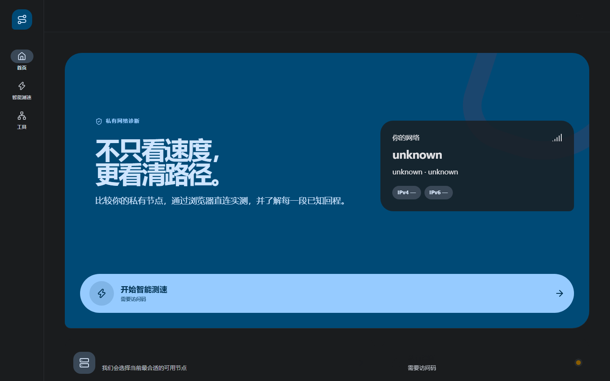

# RouteGlass

**Private, multi-node network diagnostics with direct browser-to-node speed tests, measured recommendations, and return-route visualization.**

RouteGlass combines a single Go binary with an embedded React interface. A main Server handles access, scheduling, node registration, scoring, and history; lightweight Agents run on your VPS nodes. Speed-test bytes flow directly between the browser and the selected Agent, never through the main Server.

> Status: v0.1.0. The repository contains the deployable Server/Agent vertical slice, production frontend, systemd packaging, installers, tests, and release automation. Review [Known limitations](#known-limitations) before exposing a deployment.

## Interface



The responsive public flow keeps network discovery, private access, smart testing, recommendation, and return-route visualization in one focused experience.

## Highlights

- Material 3 Expressive responsive UI, dark/light themes, zh-CN and English
- Private rotating access code and short-lived access sessions
- One-time Agent join tokens and outbound WSS control connection
- Direct adaptive download/upload testing with signed, scoped test grants
- Two-stage smart selection plus manual node testing
- Latency, jitter, loss, bandwidth, score, return traceroute, route table, and globe
- SQLite WAL storage; one statically linked binary for Linux amd64/arm64
- First-class systemd deployment, update rollback, doctor checks, and GitHub Releases
- No third-party analytics and no self-signed browser endpoint in production

## Architecture

```text
                         RouteGlass Server
                  Web / auth / scheduler / SQLite
                              │
                 outbound WSS control connections
                 ┌────────────┼────────────┐
                 ▼            ▼            ▼
              Agent A      Agent B      Agent C
                 ▲            ▲            ▲
                 └──── Browser HTTPS ──────┘
                    probe/download/upload
```

Default ports:

| Component | Address | Purpose |
|---|---|---|
| Server | `127.0.0.1:8765` | UI/API behind your existing reverse proxy |
| Agent | `:9443` | Browser-trusted HTTPS speed endpoint |
| Agent outbound | Server HTTPS/WSS | registration, heartbeat, route jobs |
| Optional Agent ACME | `:80` | public-IP HTTP-01 only when selected and free |

## Quick install

Supported hosts are systemd-based Debian/Ubuntu on amd64 or arm64.

### Server

```bash
curl -fsSL https://raw.githubusercontent.com/steinyanaa/routeglass/main/install/install.sh \
  | sudo bash -s -- server
```

The safe default listens only on loopback. Use the printed SSH tunnel, or configure your existing proxy. To have the installer add a separate managed Caddy site:

```bash
curl -fsSL https://raw.githubusercontent.com/steinyanaa/routeglass/main/install/install.sh \
  | sudo bash -s -- server --domain lg.example.com --configure-proxy caddy
```

Nginx integration is explicit too:

```bash
sudo bash install/install.sh server --domain lg.example.com --configure-proxy nginx
```

The Nginx v1 helper creates an HTTP reverse-proxy site. Add a browser-trusted certificate before entering credentials. Caddy obtains the domain certificate through its normal automatic HTTPS flow.

The initial admin username is `admin`. The installer captures the temporary password before systemd starts so it stays out of journald, displays it once, then deletes the capture file. First login requires a password change.

### Agent

In Admin, choose **Nodes → Add node**, then copy the generated command:

```bash
curl -fsSL https://lg.example.com/install/agent.sh \
  | sudo bash -s -- --join rgj_REDACTED
```

For the static GitHub installer, include the Server:

```bash
curl -fsSL https://raw.githubusercontent.com/steinyanaa/routeglass/main/install/agent.sh \
  | sudo bash -s -- --server https://lg.example.com --join rgj_REDACTED
```

The token expires after ten minutes and is single-use. After registration, the Agent atomically replaces it with its persistent identity and removes the join token from disk.

If UFW or firewalld blocks Agent traffic, repeat with `--configure-firewall`. RouteGlass adds only its required tagged rules. Native nftables layouts receive a specific instruction instead of a generic rewrite.

## DMIT / Reality / Xray coexistence

RouteGlass does not take over an existing 80/443 listener. Its Server remains at `127.0.0.1:8765`, and its Agent endpoint defaults to 9443. The installer inventories Nginx, Caddy, Xray, active listeners, and firewalls before making changes.

- Without `--configure-proxy`, existing proxy files remain untouched.
- Proxy changes live in a separate RouteGlass-marked snippet and are syntax-checked before reload.
- Existing Reality/Xray services are never stopped or reconfigured.
- Public-IP ACME uses port 80 only when it is free, or an explicitly configured challenge proxy.

See [Deployment](docs/deployment.md) for reverse-proxy examples and rollback behavior.

## Private access model

The public landing page exposes no test capacity. A six-digit code derived from a server secret and time window opens a separate 30-minute access session. The code is not an admin password. Admin sessions, diagnostic access sessions, Agent credentials, join tokens, invites, and per-test grants are distinct credential types.

Before a test, the Server signs an Ed25519 grant bound to the node, access session, observed client IP, scopes, nonce, expiry, and byte limits. Agents validate it locally and enforce concurrency, cooldown, byte caps, and daily traffic quota. Direct calls to `/download`, `/upload`, or route operations without a valid grant receive 403.

## Agent TLS

Browsers require a publicly trusted certificate for direct Agent testing. RouteGlass supports:

1. **Public IP certificate** — Let's Encrypt `shortlived` profile for IPv4 or IPv6;
2. **Node domain** — for example `node1.nodes.example.com`;
3. **Certificate files** — an administrator-managed trusted fullchain/key pair.

Let's Encrypt public-IP certificates are generally available, last 160 hours, and require HTTP-01 on public port 80 or TLS-ALPN-01 on public port 443. DNS-01 does not validate IP identifiers. RouteGlass renews automatically and reports issuance/expiry state. A TLS failure leaves control-plane heartbeat available while the speed endpoint is marked unavailable.

Full operational constraints: [Agent TLS](docs/agent-tls.md).

## Configuration and service layout

```text
/usr/local/bin/routeglass
/etc/routeglass/server.json
/var/lib/routeglass/
/etc/systemd/system/routeglass.service

/etc/routeglass-agent/agent.json
/var/lib/routeglass-agent/
/etc/systemd/system/routeglass-agent.service
```

Useful commands:

```bash
routeglass version
routeglass doctor --config /etc/routeglass/server.json
routeglass doctor --config /etc/routeglass-agent/agent.json
systemctl status routeglass
systemctl status routeglass-agent
journalctl -u routeglass -f
journalctl -u routeglass-agent -f
```

The Server has no Linux capabilities. The Agent receives only `CAP_NET_RAW`; standalone HTTP-01 adds `CAP_NET_BIND_SERVICE` through a conditional unit drop-in. Both services run under dedicated non-login users with a strict filesystem and systemd sandbox.

## Backup

Back up the Server state and configuration together:

```bash
sudo systemctl stop routeglass
sudo tar -C / -czf routeglass-backup.tgz etc/routeglass var/lib/routeglass
sudo systemctl start routeglass
```

For online operation, use the application's SQLite backup command/API rather than copying a live WAL database. Protect backups as secrets: they include admin hashes, signing material, session records, and node credentials. See [Backup and upgrade](docs/backup-upgrade.md).

## Upgrade

```bash
sudo routeglass update --component server
sudo routeglass update --component agent
# equivalent bridge
curl -fsSL https://raw.githubusercontent.com/steinyanaa/routeglass/main/install/install.sh \
  | sudo bash -s -- update server
```

The updater downloads the stable release manifest, verifies architecture, size and SHA256, stages on the same filesystem, backs up the binary and Server database, performs migration, restarts, checks readiness, and restores the previous binary/database if health verification fails.

Release artifacts include amd64/arm64 tarballs, `SHA256SUMS`, `release.json`, and GitHub build-provenance attestations.

## Uninstall

Service-only removal preserves data and configuration:

```bash
curl -fsSL https://raw.githubusercontent.com/steinyanaa/routeglass/main/install/uninstall.sh \
  | sudo bash -s -- all
```

Delete stored data, configuration, and service accounts as well:

```bash
sudo bash install/uninstall.sh all --purge
```

Only RouteGlass-marked proxy snippets and recorded firewall rules are removed.

## Development

Requirements: Go from `go.mod`, Node 24, npm, and a browser for E2E tests.

```bash
npm ci --prefix web
npm test --prefix web
npm run build --prefix web
go test ./cmd/... ./internal/...
go build -o routeglass ./cmd/routeglass
bash install/tests/run.sh
```

CI additionally runs gofmt, vet, race tests, frontend lint/typecheck, installer lint, systemd verification, and a production binary smoke test. A semantic `v*` tag builds and runs native amd64 and arm64 artifacts before publishing.

## Privacy

- No third-party analytics or advertising
- Speed bytes travel directly between browser and Agent
- Route targets are restricted to the authorized session's observed public IP
- Forwarded client headers are accepted only from configured trusted proxy CIDRs
- Unknown GeoIP data remains `unknown`; route hops are not assigned invented locations
- Retention and IP anonymization are configurable

## Troubleshooting

### Agent online, speed endpoint unavailable

Run the Agent doctor command and inspect TLS status. Verify that 9443 is reachable and the selected ACME challenge can reach public port 80/443. When those ports belong to another service, use a node domain/certificate or an explicit challenge proxy.

### Server returns the proxy address as the client

Add only the actual proxy CIDR to `trusted_proxies`. RouteGlass intentionally ignores `X-Forwarded-For` and `CF-Connecting-IP` from untrusted socket peers.

### Installer reports a port conflict

Inspect the PID/unit shown by preflight. Select another Agent port or configure the existing reverse proxy. The installer leaves the owner of the conflicting port running.

### Release checksum mismatch

Keep the current installation and retry from a clean temporary directory. Compare `SHA256SUMS` with the release page; do not install the mismatched archive.

## Security

Read [SECURITY.md](SECURITY.md) before operating a public endpoint. Report vulnerabilities through GitHub private vulnerability reporting rather than a public issue.

## Known limitations

- GeoIP databases are supplied by the operator; licensed databases are not redistributed.
- Public-IP ACME still requires globally reachable port 80 or 443 for each frequent renewal.
- Generic nftables policies are detected and documented but not automatically edited.
- Automated DNS-provider integrations and fleet-wide remote Agent upgrades are post-v1 work.

## License

[MIT](LICENSE)
